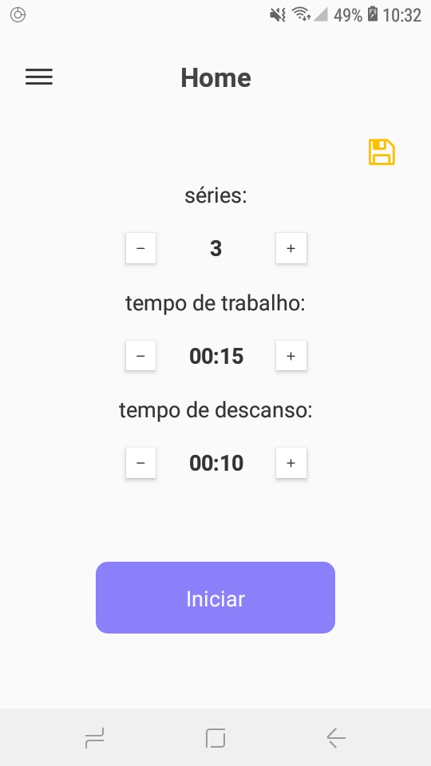
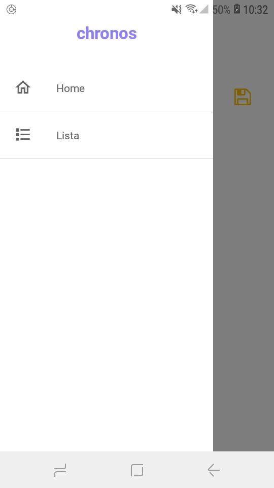
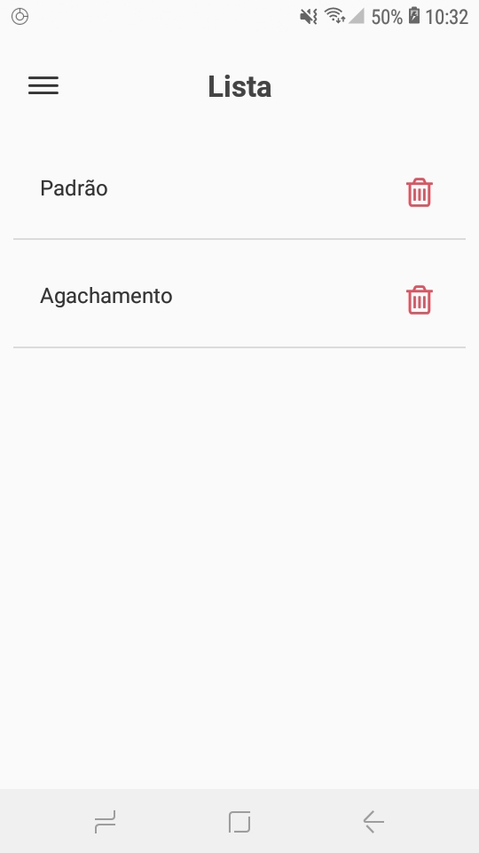
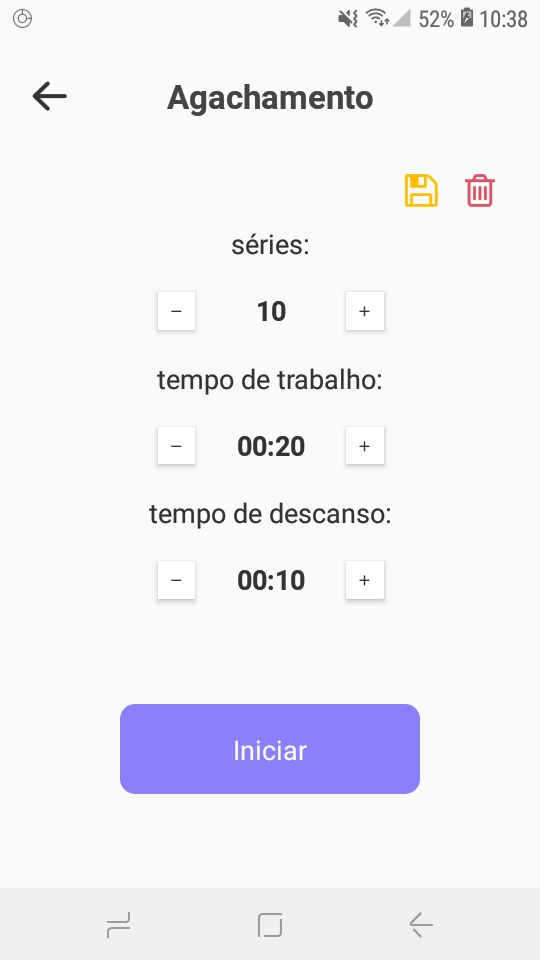
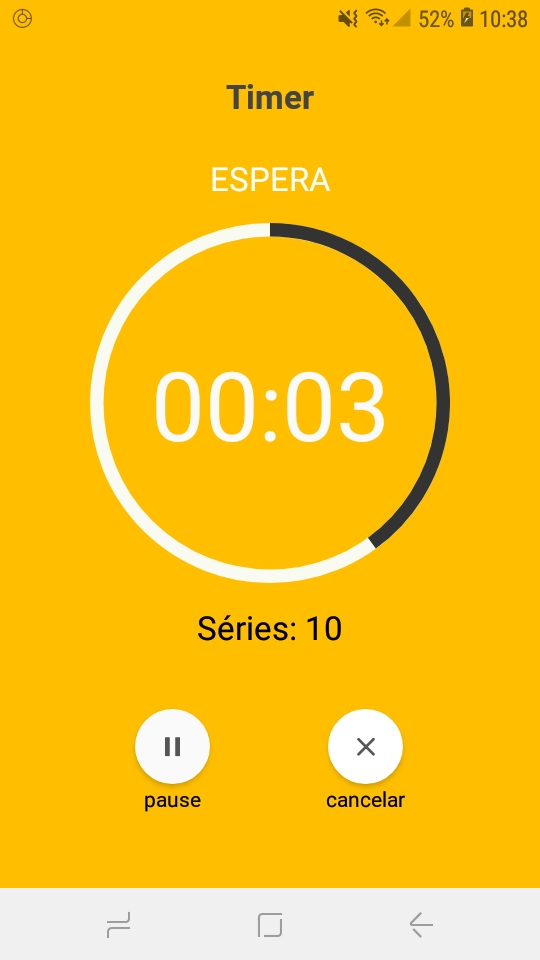
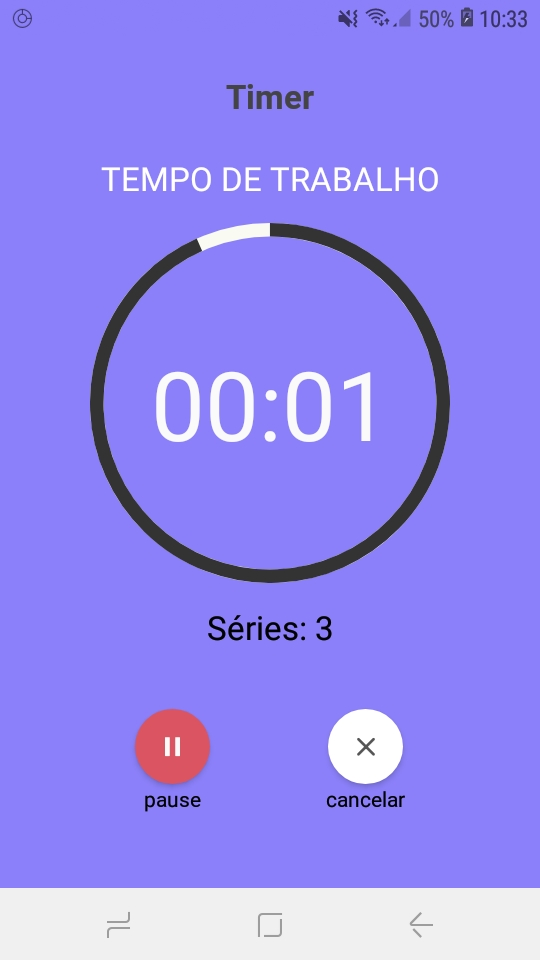
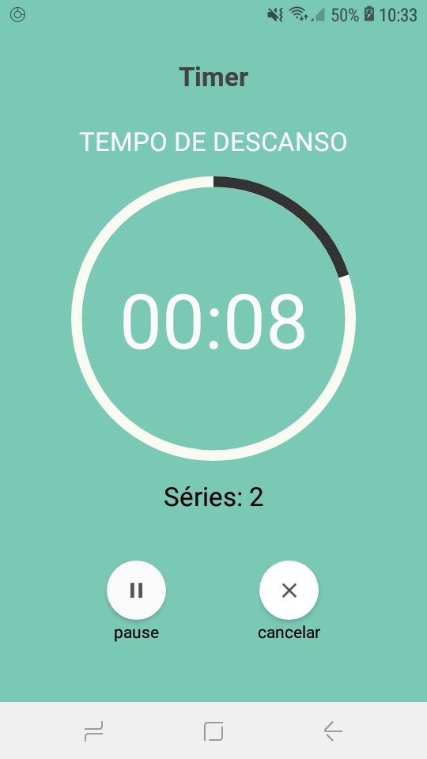

<h1 align="center">

 
chronos
</h1>

⏲ Cronômetro baseado na técnica Pomodoro.

  

## Tecnologias usadas

-   ⚛ **React Native** - Uma biblioteca JS que fornece uma maneira de criar aplicativos nativos para Android e iOS.
-   💾 **Redux** - Uma biblioteca JS para gerenciamento de estado do aplicativo.
-   💾 **Redux Persist** -Uma lib que persiste e reidrata um redux store.
-   💅🏿 **Styled Components** - Uma biblioteca que permite escrever código CSS dentro do JavaScript

## Começando

### Instalação

-   Clone este repositório `git clone https://github.com/sudo-victor/chronos.git`
-   Entre na pasta `cd chronos`
-   Intale as dependências `yarn`

### Inicialização

-   Rode `yarn start`
-   Use um emulador ou o próprio celular, com o app Expo, para visualizar a aplicação.
